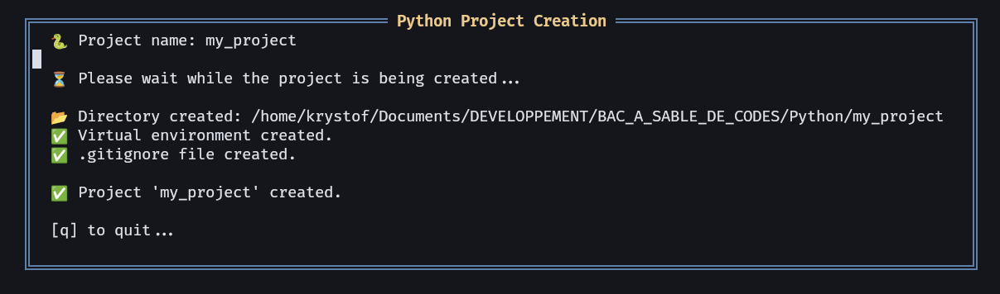

# 🐍 pyflowenv-nvim

**`pyflowenv-nvim`** is a [Neovim](https://neovim.io/) *plugin* written in [Lua](https://www.lua.org/), designed to quickly generate the minimal structure for a **Python** project: an isolated virtual environment, a `.gitignore` file, the `src/`, `assets/`, and `tests/` directories — all from an interactive interface inside **Neovim**.



This plugin is ideal for Python developers who want to **quickly initialize a project inside Neovim**, without leaving the editor (usable from [alpha](https://github.com/goolord/alpha-nvim) or via a built-in **Neovim** command).

---

## ✨ Features

- 📁 Creates a project directory and recommended architecture
- 📂 Interactive selection of the destination directory with **Telescope**
- 🐍 Automatically sets up a virtual environment with `python3 -m venv` and initializes a **Git** repository
- 🧾 Generates `.gitignore` (adapted for Python projects), `main.py`, and `README.md` files
- 💬 Interactive interface in a **Neovim** *popup* window
- 🗂️ Existing project management interface (created or added)
    - 📋 List of saved projects (sorted by last modification date)
    - 🕓 Display of last modification date in relative format (2 hours ago, yesterday, 1 month ago...)
    - 🔍 Open a project with NvimTree (`o`)
    - ❌ Delete a project (`d`)
    - ➕ Add an existing project via Telescope (`a`)
- 🏳️‍🌍 Multilingual support (`fr`, `es`, `en`)
- ⚙️ Custom configuration: venv folder name, language...

---

## 🔗 Requirements

- **Neovim** >= 0.10.4
- Requires [telescope.nvim](https://github.com/nvim-telescope/telescope.nvim) and its extension [telescope-file-browser.nvim](https://github.com/nvim-telescope/telescope-file-browser.nvim) – See [Installation](https://github.com/Krystof2so/pyflowenv-nvim?tab=readme-ov-file#-installation-with-lazynvim)
- The tool [fd](https://github.com/sharkdp/fd) (or find, rg, etc.) must be installed, as **Telescope** often relies on it:
```bash
sudo apt-get install fd-find
```

---

## 📦 Installation (with [lazy.nvim](https://github.com/folke/lazy.nvim))

Add the plugin to your **Lazy** plugin list, along with **Telescope** if it is not already installed:

```lua
{  -- nvim-telescope : search in lists
    "nvim-telescope/telescope.nvim",
    dependencies = {
        "nvim-lua/plenary.nvim",
        "nvim-telescope/telescope-file-browser.nvim",
    },
    config = function()
        require("telescope").setup({
            extensions = {
                file_browser = {
                    theme = "dropdown",
                    hijack_netrw = true,
                },
            },
        })
        require("telescope").load_extension("file_browser")
    end,
},   

{
  "Krystof2so/pyflowenv-nvim",
  config = function()
    require("pyflowenv").setup({
      -- language : "fr" (by défault), "en", "es"
      lang = "fr",
      -- repertory venv : by défault ".venv"
      venv_dir = ".venv"
    })
  end
}
```
---

## ⚙️ Configuration

```lua
require("pyflowenv").setup({
  venv_dir = ".venv", -- virtual environment folder (default)
  lang = "en",        -- language : "fr", "en", "es"
})
```
---

## 📂 Generated Structure

```
my_project/
├── .gitignore
├── .git/
├── .venv/
├── assets/
├── README.md
├── src/
│   └── my_project/
│       └── main.py
└── tests/
```

- `.venv/`: Python virtual environment (not activated automatically)  
- `.gitignore`: contains standard rules to ignore `.venv`, `__pycache__/`, `.log` files, etc.
- `main.py`: contains minimal starter code.
- `README.md`: contains `# my_project`

---

## 🌍 Available Languages

Messages displayed in *popup* windows can be dynamically translated.  
Currently supported languages:

- 🇫🇷 French (fr)  
- 🇪🇸 Spanish (es)  
- 🇬🇧 English (en)  

The choice is made via the option `lang = "en"` in `setup()`.

---

## 🔭 Roadmap (Coming Soon)

- 🧪 Detection and integration with **poetry** or **pyenv**
- 🔧 Advanced configuration (customizable *templates*)

---

## 👨‍💻 Author

Developed by Krystof26, a simple enthusiast of **Python** and **Lua** languages. I appreciate simple, efficient tools well integrated with [Neovim](https://neovim.io/).

