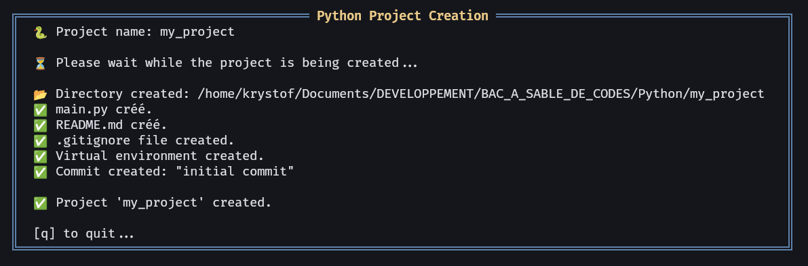

# 🐍 pyflowenv-nvim

**`pyflowenv-nvim`** is a [Neovim](https://neovim.io/) *plugin* written in [Lua](https://www.lua.org/), designed to quickly generate the minimal structure for a **Python** project: an isolated virtual environment, a `.gitignore` file, the `src/`, `assets/`, and `tests/` directories — all from an interactive interface inside **Neovim**.



This plugin is ideal for Python developers who want to **quickly initialize a project inside Neovim**, without leaving the editor (usable from [alpha](https://github.com/goolord/alpha-nvim) or via a built-in **Neovim** command).

---

## ✨ Features

- 📁 Creates a project directory and recommended architecture
- 🐍 Automatically sets up a virtual environment with `python3 -m venv` and initializes a **Git** repository
- 🧾 Generates `.gitignore` (adapted for Python projects), `main.py`, and `README.md` files
- 💬 Interactive interface in a **Neovim** *popup* window
- 🌐 Multilingual support (`fr`, `es`, `en`) with translated messages
- ⚙️ Configurable option to customize the `venv` folder name

---

## 📦 Installation (with [lazy.nvim](https://github.com/folke/lazy.nvim))

Add the plugin to your Lazy plugins list:

```lua
{
  "Krystof2so/pyflowenv-nvim",
  config = function()
    require("pyflowenv").setup({
      -- langue : "fr" (par défaut), "en", "es"
      lang = "fr",
      -- dossier venv : par défaut ".venv"
      venv_dir = ".venv"
    })
  end
}
```
---

## ⚙️ Configuration

```lua
require("pyflowenv").setup({
  venv_dir = ".venv", -- dossier de l'environnement virtuel (défaut)
  lang = "en",        -- langue : "fr", "en", "es"
})
```
---

## 📂 Generated Structure

```
my_project/
├── .gitignore
├── .git/
├── .venv/
├── assets/
├── README.md
├── src/
│   └── my_project/
│       └── main.py
└── tests/
```

- `.venv/`: Python virtual environment (not activated automatically)  
- `.gitignore`: contains standard rules to ignore `.venv`, `__pycache__/`, `.log` files, etc.
- `main.py`: contains minimal starter code.
- `README.md`: contains `# my_project`

---

## 🌍 Available Languages

Messages displayed in popup windows can be translated.  
Currently supported languages:

- 🇫🇷 French (fr)  
- 🇪🇸 Spanish (es)  
- 🇬🇧 English (en)  

The choice is made via the option `lang = "en"` in `setup()`.

---

## 🔭 Roadmap (Coming Soon)

- 🧪 Detection and integration with **poetry** or **pyenv**
- 🔍 Integration with **telescope.nvim** for directory selection

---

## 👨‍💻 Author

Developed by Krystof26, a simple enthusiast of **Python** and **Lua** languages. I appreciate simple, efficient tools well integrated with [Neovim](https://neovim.io/).

