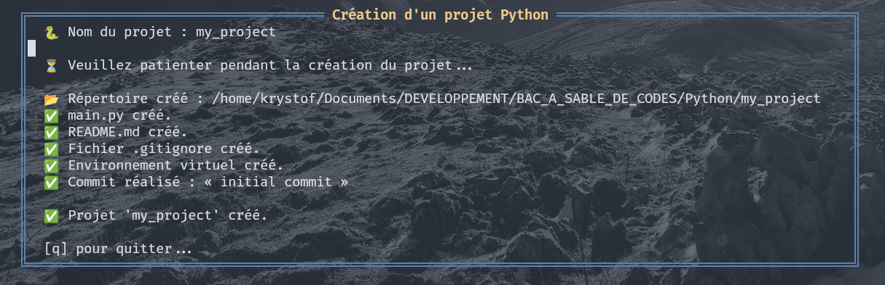

# 🐍 pyflowenv-nvim

**`pyflowenv-nvim`** est un *plugin* [Neovim](https://neovim.io/) écrit en [Lua](https://www.lua.org/), permettant de créer rapidement la structure minimale d’un projet **Python** : environnement virtuel isolé, `.gitignore`, les répertoires `src/`, `assets/` et `tests/`, le tout depuis une interface interactive dans **Neovim**.



Ce plugin est idéal pour les développeurs Python qui veulent **initialiser rapidement un projet dans Neovim**, sans avoir à quitter l'interface (utilisable depuis [alpha](https://github.com/goolord/alpha-nvim) ou via une commande intégrée à **Neovim**)

---

## ✨ Fonctionnalités

- 📁 Création d’un répertoire et d'une architecture pour le projet
- 🐍 Génération automatique d’un environnement virtuel avec `python3 -m venv` et d'un dépôt **Git**
- 🧾 Création des fichiers `.gitignore` (adapté aux projets Python), `main.py` et `README.md`
- 💬 Interface interactive dans une fenêtre *popup* **Neovim**
- 🌐 Support multilingue (`fr`, `es`, `en`) avec messages traduits
- ⚙️ Option configurable pour personnaliser le nom du dossier `venv`

---

## 📦 Installation (avec [lazy.nvim](https://github.com/folke/lazy.nvim))

Ajoutez le plugin dans la liste des plugins Lazy :

```lua
{
  "Krystof2so/pyflowenv-nvim",
  config = function()
    require("pyflowenv").setup({
      -- langue : "fr" (par défaut), "en", "es"
      lang = "fr",
      -- dossier venv : par défaut ".venv"
      venv_dir = ".venv"
    })
  end
}
```
---

## ⚙️ Configuration

```lua
require("pyflowenv").setup({
  venv_dir = ".venv", -- dossier de l'environnement virtuel (défaut)
  lang = "en",        -- langue : "fr", "en", "es"
})
```
---

## 📂 Structure générée

```
mon-projet/
├── .gitignore
├── .git/
├── .venv/
├── assets/
├── README.md
├── src/
│   └── mon_projet/
│       └── main.py
└── tests/
```

- `.venv/` : environnement virtuel Python (non activé automatiquement)
- `.gitignore` : contient des règles standards ̀.venv`, `__pycache__/`, fichiers `.log`, etc.
- `main.py` : contient un code minimal.
- `README.md` : contient `# mon_projet`

---

## 🌍 Langues disponibles

Les messages affichés dans les fenêtres *popup* peuvent être traduits.
Langues actuellement supportées :

- 🇫🇷 Français (fr)
- 🇪🇸 Espagnol (es)
- 🇬🇧 Anglais (en)

Le choix se réalise via l'option `lang = "en"` dans `setup()`.

---

## 🔭 Feuille de route (à venir)

- 🧪 Détection et intégration avec **poetry** ou **pyenv**
- 🔍 Intégration avec **telescope.nvim** pour sélectionner un répertoire

---

## 👨‍💻 Auteur

Développé par Krystof26, simple amateur des langages **Python** et **Lua**. J'apprécie les outils simples, efficaces et bien intégrés à [Neovim](https://neovim.io/).


